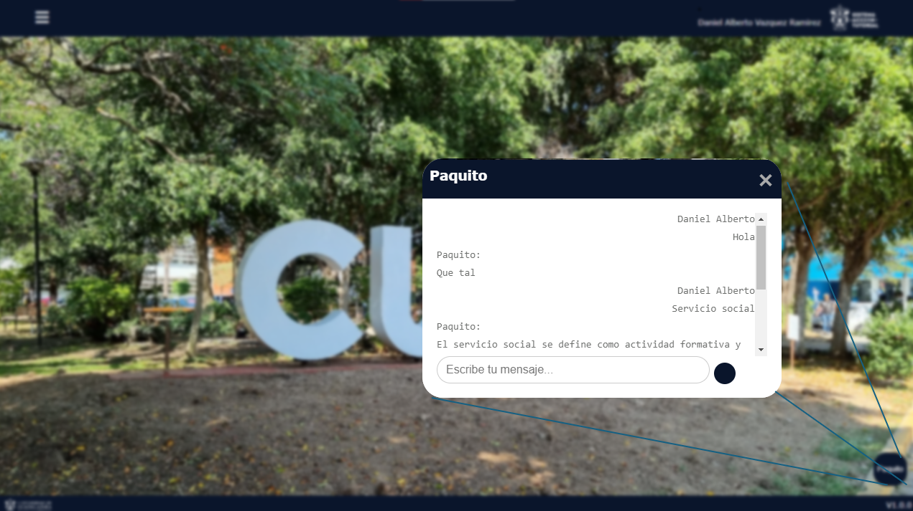

# SistemaAccionTutorial
This system allows for assigning tutoring and connecting tutors with students who need them. The web platform implements a powerful tool, such as a chatbot, that answers questions about university regulations. Finally, the K-means algorithm classifies the types of students who receive tutoring.

Developed by Daniel Alberto Vazquez Ramirez, Jose de Jesus Rodriguez Hernandez, and Edgar Maximiliano Morales Morales.
